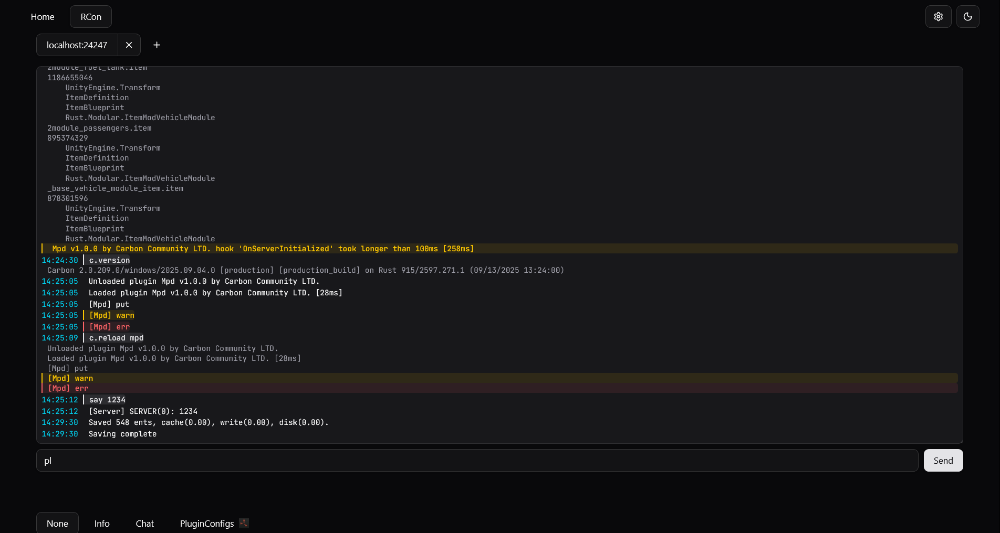

# Rust RCon Web

<p align="center">
  A modern, reliable, and feature-rich web interface for your Rust game server's RCon.
</p>

---

Check out the live version: [rust-rcon-web.evs-ptr.workers.dev](https://rust-rcon-web.evs-ptr.workers.dev)



## Features

- **Real-Time Console & Chat:** A color-coded console and a dedicated, clean in-game chat view. No more cluttered logs.
- **Effortless Server Management:** Save, manage, and instantly switch between multiple server configurations. Your settings are persisted locally and even synced across browser tabs.
- **Intelligent Console UI:** Includes essential features like command history (use arrow keys!), smart auto-scrolling that doesn't interrupt you, and a responsive design for any device.
- **Secure & Private:** Credentials are never stored unless you explicitly choose to save them in your browser's local storage. Supports secure `wss://` connections out of the box.
- **Open Source:** Built with a modern, transparent, and open-source stack.

## Why?

This project was built to provide a modern, fast, and enjoyable RCon experience. While other tools exist, Rust RCon Web focuses on:

- **Modern Technology:** Built with **Svelte 5**, Vite, and TypeScript for a blazing-fast and reactive UI.
- **User Experience:** From smart scrolling to command history, every feature is designed with the server administrator's workflow in mind.
- **Simplicity:** A clean, intuitive interface that's easy to use from the start.

## Getting Started

### Prerequisites

- [Bun](https://bun.sh/) or [Node.js](https://nodejs.org/) (v20 or higher)

### Installation & Running

1.  **Clone the repository:**

    ```sh
    git clone https://github.com/evs-ptr/rust-rcon-web.git
    cd rust-rcon-web
    ```

2.  **Install dependencies:**

    ```sh
    # With Bun
    bun install

    # Or with npm
    npm install
    ```

3.  **Run the development server:**

    ```sh
    # With Bun
    bun run dev

    # Or with npm
    npm run dev
    ```

The application will be available at `http://localhost:5173`.

## Testing

This project uses [Vitest](https://vitest.dev/) for unit testing.

- **Run all tests:**

  ```sh
  bun run test
  ```

- **Run tests in watch mode:**
  ```sh
  bun run test:unit
  ```

## Project Structure

```
.
├── src
│   ├── lib
│   │   ├── config-state.svelte.ts  # Global UI state management (Svelte 5 Runes)
│   │   ├── storage-synced.ts       # localStorage persistence & cross-tab sync
│   │   └── components/ui/          # Reusable Shadcn UI components
│   ├── routes
│   │   ├── +page.svelte            # The main landing page
│   │   └── rcon/                   # Core RCON application logic and components
│   │       ├── +page.svelte        # Entry point for the /rcon route
│   │       ├── rust-rcon.ts        # Handles RCON message protocol
│   │       ├── websocket-wrapper.ts# Manages the WebSocket connection & reconnects
│   │       ├── servers-manager.svelte.ts # Manages adding, deleting, and switching servers
│   │       ├── ServerMain.svelte   # Main component for a connected server
│   │       ├── ServerConsole.svelte# The interactive console component
│   │       └── ServerChat.svelte   # The interactive chat component
│   └── tests/                      # Vitest unit tests
├── static/                         # Static assets (images, favicon)
└── package.json                    # Project dependencies and scripts
```

## Similar Projects

- **[Carbon Control Panel](https://carbonmod.gg/tools/control-panel/)** by Carbon Community
  - An RCon tool that is part of a larger ecosystem for the Carbon modding framework.
  - Has some Carbon-only features.
  - **Source:** [github.com/CarbonCommunity/Carbon.Documentation](https://github.com/CarbonCommunity/Carbon.Documentation)
  - **Framework Source**: [github.com/CarbonCommunity/Carbon](https://github.com/CarbonCommunity/Carbon)

- **[webrcon](https://facepunch.github.io/webrcon/#/home)** by Facepunch
  - A RCon tool directly from the creators of Rust.
  - **Source:** [github.com/Facepunch/webrcon](https://github.com/Facepunch/webrcon)

## Technologies Used

*   **Framework:** [SvelteKit](https://kit.svelte.dev/)
*   **Language:** [TypeScript](https://www.typescriptlang.org/)
*   **Styling:** [Tailwind CSS v4](https://tailwindcss.com/)
*   **UI Components:** [shadcn-svelte](https://www.shadcn-svelte.com/) (a collection of reusable Svelte components)
*   **Icons:** [Lucide Svelte](https://lucide.dev/guide/packages/lucide-svelte)
*   **Build Tool:** [Vite](https://vitejs.dev/)
*   **Testing:** [Vitest](https://vitest.dev/) for unit tests.
*   **Runtime:** [Bun](https://bun.sh/)

## Contributing

Contributions are welcome.

## License

Distributed under the MIT License.
