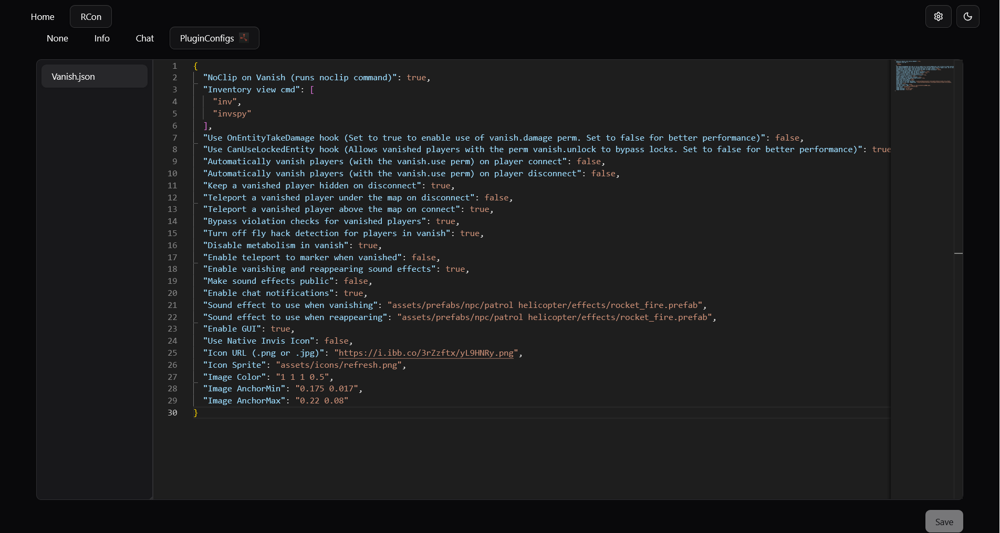

# Rust RCon Web

A fast, reliable, and feature-rich web-based remote console (RCon) for Rust servers. Built with modern technologies to provide a seamless experience for server administrators.

## Live Demo

Check out the live version: [rust-rcon-web.evs-ptr.workers.dev](https://rust-rcon-web.evs-ptr.workers.dev)




## Features

- **Live Console:** Real-time log streaming with configurable history and color-coded message types.
- **Integrated Chat View:** See in-game chat directly in the console, separate from server logs.
- **Command History:** Easily navigate and re-execute previous commands.
- **Multi-Server Management:** Save and switch between multiple Rust servers effortlessly.
- **Resilient Reconnect:** Automatic reconnection with exponential back-off, connection timeout, and max attempts ensures you stay connected.
- **Secure by Default:** Supports secure WebSocket (`wss://`) connections and never stores credentials unless specified.
- **Open-Source:** MIT licensed and built with a modern, open-source stack.
- **Great DX:** Fast, modern tooling like Bun and Vite provides near-instant Hot Module Replacement (HMR) for a fluid development workflow.

## Technologies Used

- **Framework:** [SvelteKit](https://kit.svelte.dev/)
- **Language:** [TypeScript](https://www.typescriptlang.org/)
- **Styling:** [Tailwind CSS v4](https://tailwindcss.com/)
- **UI Components:** [shadcn-svelte](https://www.shadcn-svelte.com/) (a collection of reusable Svelte components)
- **Icons:** [Lucide Svelte](https://lucide.dev/guide/packages/lucide-svelte)
- **Build Tool:** [Vite](https://vitejs.dev/)
- **Testing:** [Vitest](https://vitest.dev/) for unit tests.
- **Runtime:** [Bun](https://bun.sh/)

## Getting Started

Follow these instructions to get a local copy up and running for development and testing purposes.

### Prerequisites

This project recommends using [Bun](https://bun.sh/) for its speed, but it is not required. You can use [Node.js](https://nodejs.org/) with `npm` as well.

- **Recommended:** [Bun](https://bun.sh/)
- **Alternative:** [Node.js](https://nodejs.org/) (v20 or higher)

### Installation

1. **Clone the repository:**

   ```sh
   git clone https://github.com/evs-ptr/rust-rcon-web
   cd rust-rcon-web
   ```

2. **Install dependencies:**

   ```sh
   # With Bun
   bun install

   # Or with npm
   npm install
   ```

3. **Run the development server:**

   ```sh
   # With Bun
   bun run dev

   # Or with npm
   npm run dev
   ```

The application will be available at `http://localhost:5173`.

### Building for Production

To create a production version of the app:

```sh
# With Bun
bun run build

# Or with npm
npm run build
```

You can preview the production build with `bun run preview` or `npm run preview`.

## Testing

This project uses [Vitest](https://vitest.dev/) for unit testing.

- **Run all tests:**

  ```sh
  # With Bun
  bun run test

  # Or with npm
  npm run test
  ```

- **Run tests in watch mode:**

  ```sh
  # With Bun
  bun run test:unit

  # Or with npm
  npm run test:unit
  ```

Test files are located in the `src/tests` directory.

## Project Structure

```
.
├── src
│   ├── lib
│   │   ├── components/ui  # Reusable UI components from shadcn-svelte
│   │   └── utils.ts       # Utility functions
│   ├── routes
│   │   ├── +page.svelte   # Landing page
│   │   └── rcon           # RCon interface, logic, and components
│   └── tests              # Unit tests
├── static                 # Static assets (e.g., favicon)
└── package.json           # Project dependencies and scripts
```

## Similar Projects

Here are a few other web-based RCon tools for Rust:

- **[Carbon Control Panel](https://carbonmod.gg/tools/control-panel/)** by Carbon Community
  - An RCon tool that is part of a larger ecosystem for the Carbon modding framework.
  - Has some Carbon-only features.
  - **Source:** [github.com/CarbonCommunity/Carbon.Documentation](https://github.com/CarbonCommunity/Carbon.Documentation)
  - **Framework Source**: [github.com/CarbonCommunity/Carbon](https://github.com/CarbonCommunity/Carbon)

- **[webrcon](https://facepunch.github.io/webrcon/#/home)** by Facepunch
  - A RCon tool directly from the creators of Rust.
  - **Source:** [github.com/Facepunch/webrcon](https://github.com/Facepunch/webrcon)

## Contributing

Contributions are what make the open-source community such an amazing place to learn, inspire, and create. Any contributions you make are **greatly appreciated**.

## License

Distributed under the MIT License.
